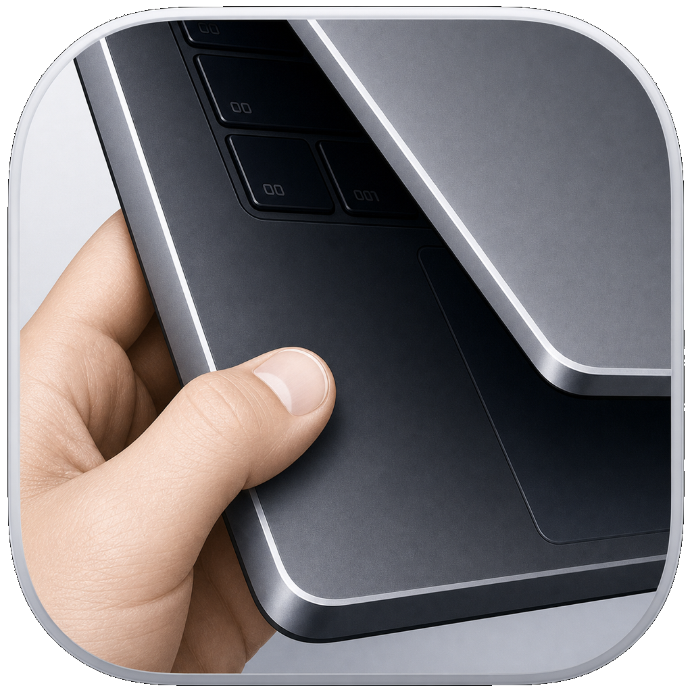

# NoAjar - 로컬 코딩 에이전트를 위한 Mac 잠자기 제어

한국어 | [English](README.md)

<p align="center">
  
</p>

NoAjar는 맥북을 살짝 열어둔 채로 두지 않아도 코딩 에이전트를 계속
실행할 수 있게 해주는 작은 macOS 메뉴 막대 앱입니다.

이제 맥북을 닫아두고 사용하세요.

Codex, Claude Code, OpenCode, OpenClaw, SSH, 백그라운드 빌드와
테스트처럼 로컬에서 오래 도는 에이전트 워크플로우를 위해 만들었습니다.

## 다운로드

GitHub에서 최신 릴리스를 내려받을 수 있습니다.

[NoAjar.zip 다운로드](https://github.com/gityeop/NoAjar/releases/latest/download/NoAjar.zip)

설치 방법:

1. `NoAjar.zip`을 다운로드합니다.
2. 압축을 풉니다.
3. `NoAjar.app`을 `/Applications`로 옮깁니다.
4. NoAjar를 실행한 뒤 메뉴 막대 아이콘에서 모드를 선택합니다.

No Ajar Mode를 처음 사용할 때는 닫힌 맥북의 잠자기 동작을 제어하기 위해
작은 helper를 설치하므로 관리자 권한이 필요합니다.

## 모드

NoAjar에는 두 가지 사용자 모드가 있습니다.

| 모드 | 동작 |
| --- | --- |
| Awake Mode | 맥북이 열린 상태에서 Mac과 디스플레이가 잠자기 상태로 들어가지 않게 합니다. 일반 macOS sleep assertion을 사용하며, 덮개를 닫았을 때의 동작은 바꾸지 않습니다. |
| No Ajar Mode | 맥북 덮개를 완전히 닫아도 Mac이 잠들지 않게 합니다. `pmset disablesleep 1`을 활성화하되, 기본적으로 디스플레이는 잠들 수 있게 둡니다. |

메뉴 막대 앱은 의도적으로 작은 메뉴를 유지합니다.

```text
💤

Awake Mode
No Ajar Mode
Turn Off
Apps
Settings
Quit
```

## 메뉴

메뉴 막대 제목은 상태에 따라 바뀝니다.

- `💤`: 비활성 상태
- `☕`: Awake Mode 활성
- `🚀`: No Ajar Mode 활성

Awake Mode와 No Ajar Mode에는 각각 다음 항목이 있습니다.

- Start Until Stopped
- Start 30 Minutes
- Start 1 Hour
- Start 4 Hours
- Start 8 Hours
- Stop Below: 배터리가 지정한 퍼센트 아래로 내려가면 NoAjar 세션을 자동으로 종료합니다.
- Keep Running: 배터리 퍼센트 자동 종료 없이 세션을 유지합니다.

Apps에는 다음 항목이 있습니다.

- App Auto Awake: 설정한 앱 또는 프로세스 이름이 실행 중일 때 자동으로 시작합니다.
- Add Apps: 프로세스 이름을 직접 입력하지 않고 `.app` 번들을 선택합니다.
- Clear Apps: 감시 중인 앱 목록을 지웁니다.
- Mode: App Auto Awake에서 사용할 Awake Mode 또는 No Ajar Mode를 선택합니다.

No Ajar Mode는 처음 한 번 helper를 설치한 뒤, 이후 세션을 시작할 때마다
관리자 프롬프트를 띄우지 않고 동작합니다.

Settings에는 다음 항목이 있습니다.

- Hotkey: NoAjar 메뉴를 엽니다. 기본값은 Cmd-Opt-L이며 변경할 수 있습니다.
  Set Hotkey를 눌러 단축키를 직접 입력합니다.
- Launch at Login
- Check for Updates: 업데이트 확인 창을 엽니다.
- Automatically Check for Updates: 하루에 한 번 업데이트를 확인합니다.
- Automatically Install Updates: 가능한 경우 업데이트를 백그라운드에서 다운로드하고 설치합니다.
- Version: 설치된 앱 버전과 빌드를 표시합니다.

핫키 메뉴 탐색:

- 설정한 핫키를 눌러 메뉴를 엽니다.
- Cmd-1은 Awake Mode, Cmd-2는 No Ajar Mode를 엽니다.
- 1, 2, 3, 4, 5를 눌러 Until Stopped, 30 Minutes, 1 Hour, 4 Hours, 8 Hours를 시작합니다.

## 소스에서 빌드

전체 빌드:

```sh
make build
```

앱 번들 빌드:

```sh
make app
```

앱 번들은 다음 경로에 생성됩니다.

```text
build/NoAjar.app
```

실행:

```sh
open build/NoAjar.app
```

helper 제거:

```sh
make uninstall-helper
```

## CLI

앱 번들에는 `noajar` CLI가 포함되어 있습니다.

다운로드한 앱에서 바로 실행할 수 있습니다.

```sh
/Applications/NoAjar.app/Contents/Helpers/noajar status
```

터미널 어디서든 `noajar`로 실행하려면 한 번만 심볼릭 링크를 만듭니다.

```sh
sudo ln -sf /Applications/NoAjar.app/Contents/Helpers/noajar /usr/local/bin/noajar
```

No Ajar Mode를 8시간 동안 실행:

```sh
noajar start --no-ajar --duration 8h
```

Awake Mode를 1시간 동안 실행:

```sh
noajar start --awake --duration 1h
```

배터리 사용을 허용하되 40%에서 중지:

```sh
noajar start --no-ajar --allow-battery --min-battery 40
```

상태 확인:

```sh
noajar status
```

정상 잠자기 동작 복원:

```sh
noajar stop
```

## 안전

닫힌 맥북을 가방이나 밀폐된 공간 안에서 실행한 채로 오래 두지 마세요.
No Ajar Mode는 발열과 배터리 소모를 만들 수 있습니다. 가능하면 전원을 연결하고,
안정적인 표면 위에서 제한된 시간 동안 사용하세요.
